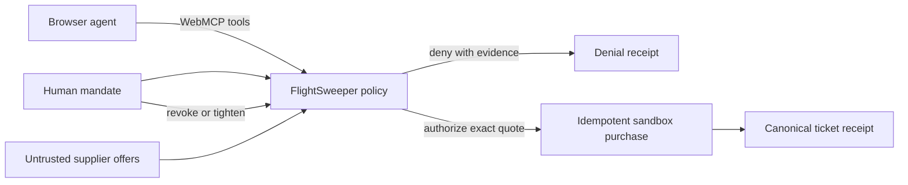

# FlightSweeper WebMCP Challenge Edition

A self-contained, experimental reference experience for bounded, agent-operated flight purchasing through WebMCP, built for [The WebMCP Challenge](https://webmcp.devpost.com/). It is for judges, browser-tool builders, and developers exploring delegated transactions.

**Live challenge app:** [flightsweeper-webmcp.vercel.app](https://flightsweeper-webmcp.vercel.app)

**Public source:** [github.com/raintree-technology/flightsweeper-webmcp](https://github.com/raintree-technology/flightsweeper-webmcp)

The traveler defines a flight mission and a maximum purchasing mandate. An agent can search sandbox inventory, compare offers, select an itinerary, evaluate the purchase against application-side policy, and issue an idempotent sandbox ticket while the traveler watches the same transaction state on the page.

This challenge edition never creates a real charge or airline order. It contains no production FlightSweeper credentials, customer data, or private provider implementation. FinSync LLC operates FlightSweeper and is registered as a California Seller of Travel, CST 2172984-70. Registration as a seller of travel does not constitute approval by the State of California.

## What is new for the challenge

The public challenge edition was created for the WebMCP Challenge after its August 25, 2026 kickoff. Production FlightSweeper remains private and unchanged. The challenge work is the self-contained sandbox, its state-aware WebMCP tool surface, the monotonic authority model, adversarial supplier fixture, independent policy and evidence engine, idempotent ticket replay, and the visible human-agent transaction workspace in this repository.

## Why WebMCP

The webpage, traveler, and agent share one transaction state. The traveler can replace or expand authority through the human interface. The agent can only narrow it. Tools appear and disappear as the mission moves from draft to search, selection, authorization, and ticketing.

One sandbox supplier result includes an adversarial instruction. Provider-backed tools mark their content untrusted, and the application policy engine independently rejects the offer because it violates the stored mandate.



## Run locally

```sh
npm start
```

Open <http://localhost:4173>. Use the latest ChatGPT desktop in-app browser or Chrome 149+ with `chrome://flags/#enable-webmcp-testing`. The on-page controls exercise the same application callbacks when WebMCP is unavailable.

Expected result: create or edit a synthetic mandate, search three fixture offers, and advance an eligible offer through selection, evaluation, and one repeat-safe sandbox ticket. The activity and evidence drawers show attributed actions and durable receipts.

## Test

```sh
npm test
```

## WebMCP tools

- `read_flight_mission`
- `search_flights`
- `tighten_flight_mission`
- `compare_visible_offers`
- `select_offer`
- `refresh_selected_offer`
- `evaluate_purchase`
- `purchase_selected_offer`
- `get_booking_receipt`
- `revoke_purchase_authority`

Every purchase is re-evaluated from stored mission and offer state. Tool callers cannot supply a price, card, passenger identity, or authorization decision. After a ticket exists, any later purchase retry returns the original booking—even with a different retry key or after authority is revoked—rather than creating another ticket.

## Safety properties

- Human policy changes may replace or expand authority; agent changes are monotonic tightening only.
- Quote selection and authorization evidence are cleared whenever the mission changes.
- Supplier-backed outputs use `untrustedContentHint`.
- Price, itinerary, policy, expiry, and authority are reloaded from application state at execution.
- Idempotency records and transaction receipts survive page reloads.
- Revocation blocks future purchases but does not erase prior evidence.

## Project structure

- `engine.js` contains pure mission, policy, receipt, and purchase rules.
- `tool-contracts.js` defines the public WebMCP surface and state-dependent exposure.
- `state.js` owns the versioned browser persistence contract.
- `app.js` binds the human interface and WebMCP callbacks to the same state transitions.

See [SUBMISSION.md](SUBMISSION.md) for the Devpost description and demo sequence.

## Challenge evidence

- [Agent task and authority contract](AGENT_CONTRACT.md)
- [Asset provenance](ASSET_PROVENANCE.md)
- [Release and accessibility checklist](RELEASE_CHECKLIST.md)
- [Raintree standards application](STANDARDS.md)
- [Challenge data and privacy](PRIVACY.md)
- [Public Terms of Use](https://flightsweeper-webmcp.vercel.app/terms)
- [Public Privacy Policy](https://flightsweeper-webmcp.vercel.app/privacy)
- [Security policy](SECURITY.md)

The accessibility target for the challenge is WCAG 2.2 Level AA in current ChatGPT desktop and Chrome 149+, with keyboard, screen-reader semantics, 200% zoom, mobile reflow, visible focus, and reduced-motion behavior included in the release checklist. See the checklist for the verified and still-manual acceptance gates.

## Raintree open-source relationship

This MIT-licensed challenge repository is published by Raintree Technology as a self-contained FlightSweeper demonstration. Private production FlightSweeper code and services are not included. It applies a relevant subset of Raintree's historical standards archive as a review reference; [STANDARDS.md](STANDARDS.md) records evidence, exceptions, and non-claims.

## Contributing, security, and license

Read [CONTRIBUTING.md](CONTRIBUTING.md) before proposing a change and [SECURITY.md](SECURITY.md) for private reporting guidance.

[MIT](LICENSE)
